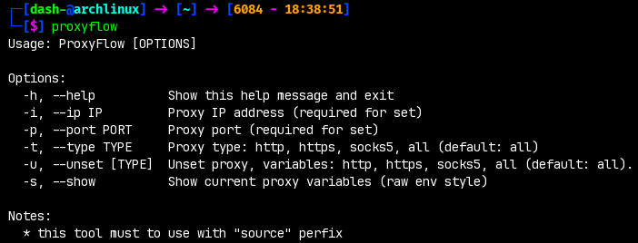

# proxyflow
ProxyFlow – A simple terminal tool to quickly set, unset, and manage HTTP, HTTPS, and SOCKS5 proxy environment variables in your current shell session.

- Supports selective proxy types or all at once.
- Shows current proxy settings in a clean format.
- Designed to work seamlessly with `source` for immediate effect in the current terminal.



# usage

### 1: run proxyflow.sh like that:

```
source proxyflow.sh
```


### 2 : or if yoy want to be acces anyware:

move proxyflow.sh to ```~/.local/bin```.

then write this line on ```~/.zshrc``` or ```~/.bashrc```

```
alias proxyflow='source proxyflow.sh
```

# example
```
proxyflow -u all -i 127.0.0.1 -p 1080 -t all
```

The output will be something like this:

```
http proxy   : <unset>
https proxy  : <unset>
socks5 proxy : <unset>
http proxy   : 127.0.0.1:1080
https proxy  : 127.0.0.1:1080
socks5 proxy : 127.0.0.1:1080
```
